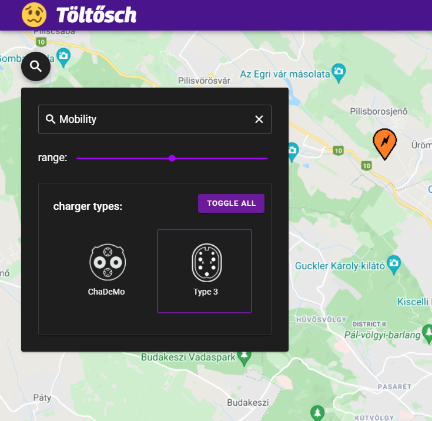
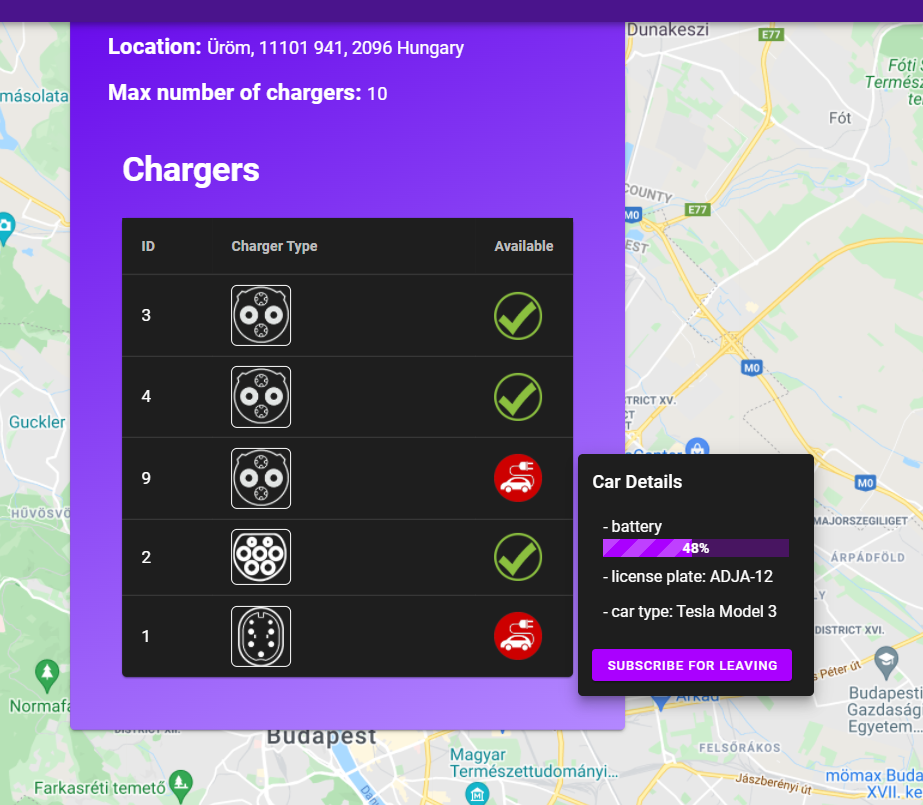
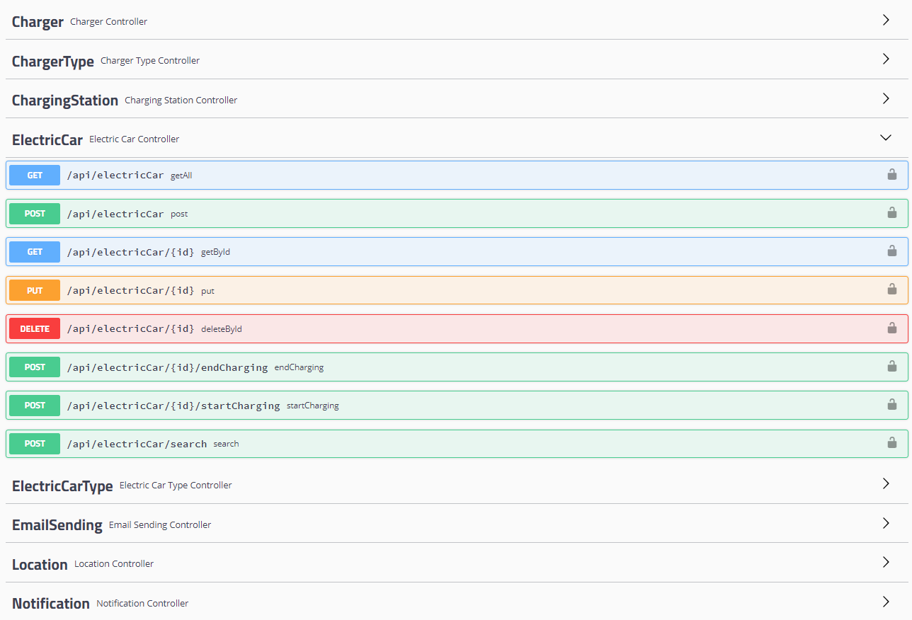
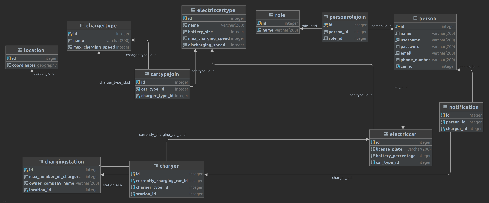

# ev-charger-app

## Overview
This is a one semester school project about making a full-stack web application using Spring Boot, Vue.js, PostgreSQL and many other technologies.
The goal was to make a clone of an app which helps electric vehicle users find available chargers, get email notifications when a nearby charger gets empty, and when their car has reached a certain battery percentage.

## Features
* Complete backend API representing the above explained world of cars, users and chargers using mock cars being handled by the backend.
* Swagger API documentation
* User authentication using Spring Security and JWT tokens
* Google maps integration
* PostgreSql database with a geospatial extension (PostGIS), which makes it possible to query the nearest chargers from the user's current location
* Live updates of battery percentages using websocket
* Dockerized frontend, backend and database, which makes it possible to launch the app everywhere without versions problems, using just one command
* Github Actions (CI/CD) pipeline building these docker images on every push to the master

## Launching

using docker: `docker-compose up -d`

## Try it out

* app: `localhost:8081`
* swagger: `localhost:8080/swagger-ui.html`

## Screenshots

#### Login page

#### Filter

#### Charging station details

#### Swagger API documentation

#### Database schema

